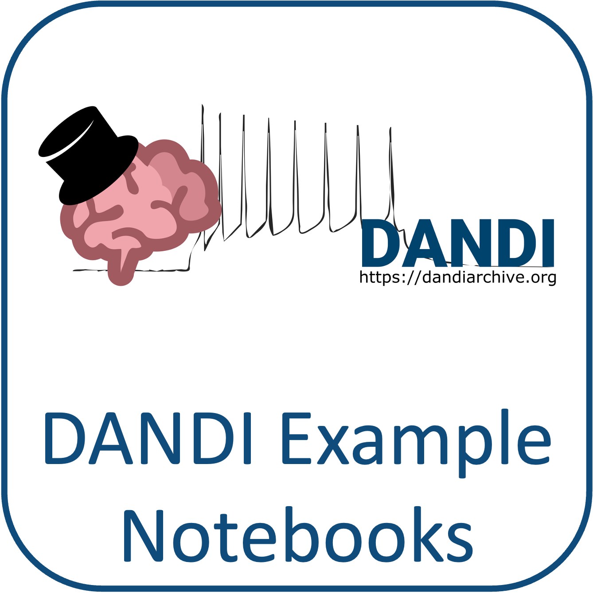

.. _community-gallery:

***************************
Community Gallery
***************************

This page is a collection of community conversion and analysis projects cataloged here as a convenient reference for NWB users. This list is not comprehensive and many of the projects and resources are built and supported by other groups, and are in active development. If you would like to contribute a project or resources, please see the instructions :nwb-overview-src:`here <>`.

Data Conversion
---------------

:neuroconv-docs:`NeuroConv Catalog <catalogue/catalogue.html>` is a collection of real-world examples of labs using :neuroconv-docs:`NeuroConv <>` to convert their data to NWB files. Each project listed contains a description and a link to an open GitHub repository. Many of the projects listed use advanced customization features beyond what is demonstrated in the core :neuroconv-docs:`NeuroConv conversion gallery <conversion_examples_gallery/conversion_example_gallery.html>`

.. raw:: html

     

.. image:: figures/bristol_neuroscience_data_guide.png
    :class: align-left, no-scaled-link
    :width: 100

The Bristol Neuroscience Data Guide includes tutorials for converting data to NWB for `extracellular electrophysiology data <https://dervinism.github.io/bristol-neuroscience-data-guide/tutorials/Bristol%20GIN%20for%20Silicon%20Probe%20Data.html>`_   and `optical physiology data <https://dervinism.github.io/bristol-neuroscience-data-guide/tutorials/Bristol%20GIN%20for%20Calcium%20Imaging%20Data.html>`_ using both the :pynwb-docs:`PyNWB <>` and :matnwb-docs:`MatNWB <>` APIs for NWB.

.. raw:: html

     

Data Analysis and Reuse
-----------------------

:ref:`analysistools-dandi` (Distributed Archives for Neurophysiology Data Integration) maintains a `collection of example notebooks <https://github.com/dandi/example-notebooks>`_ associated with datasets, conference tools, or more generally notebooks that illustrate the use of data on DANDI.

.. note::

        **Disclaimer:** Reference herein to any specific product, process, or service
        by its trade name, trademark, manufacturer, or otherwise, does not constitute or
        imply its endorsement, recommendation, or favoring by the NWB development team,
        United States Government or any agency thereof, or The Regents of the University
        of California. Use of the NeurodataWithoutBorders name for endorsements is prohibited.

