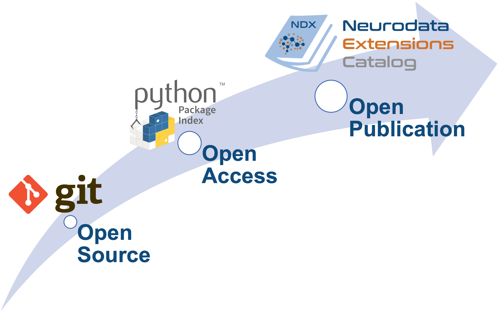

Publishing extensions
---------------------

Neurodata extensions can be shared with the community using the :ndx-catalog:`NDX Catalog <>`.
As illustrated in the figure, the publication process is divided into three main steps:
1) open release of the sources to the community using git, 2) open access of versioned
releases via PyPI, and 3) open publication of the extension to the community via the
:ndx-catalog:`NDX Catalog <>`.

Open Source: Releasing your extension Git repository
^^^^^^^^^^^^^^^^^^^^^^^^^^^^^^^^^^^^^^^^^^^^^^^^^^^^^

1. Before publishing your licence online you should add a license file. Permissive licenses should be used if possible. A `BSD license <https://opensource.org/licenses/BSD-3-Clause>` is recommended.
2. Modify ``README.md`` at the root directory of your extension repo to describe the extension for interested developers and users.
3. The first step to publishing your extension then is to make your Git repository accessible online
   via GitHub, or any other public Git hosting service of your choice. To publish your extension
   on GitHub you will need a `GitHub account <https://github.com/>`_ and follow the following
   `instructions to add an existing project to GitHub <https://help.github.com/en/articles/adding-an-existing-project-to-github-using-the-command-line>`
4. Make a release for the extension on GitHub with the version number specified. e.g. if the version
   is ``0.1.0``, then this page should exist: https://github.com/<my_username>/<my_extension>/releases/tag/0.1.0``.
   See the `creating a release guide <https://help.github.com/en/github/administering-a-repository/creating-releases>` on GitHub for instructions on how to make a release on GitHub.

.. note::

   We here focus on GitHub mainly because it is the services that is currently most commonly used by users
   to share extension code repositories. However, NWB does not require the use of GitHub but users may use other
   systems e.g., GitLab or Bitbucket, to share their sources.

Open Access: Publish your extension on PyPI
^^^^^^^^^^^^^^^^^^^^^^^^^^^^^^^^^^^^^^^^^^^

To make your extension installable for users via pip and manage public releases NWB uses the
`Python Package Index (PyPI) <https://pypi.org/>`_ index.

1. Follow `these directions <https://packaging.python.org/tutorials/packaging-projects/>`_ to package your project.
   You may need to modify ``setup.py``. If your extension version is ``0.1.0``, then this page
   should exist: ``https://pypi.org/project/<myextension>/0.1.0``
2. Once your GitHub release and ``setup.py`` are ready, publishing on PyPI:

.. code-block:: bash

    python setup.py sdist bdist_wheel
    twine upload dist/*

Open Publication: Publishing your extension on the NDX Catalog
^^^^^^^^^^^^^^^^^^^^^^^^^^^^^^^^^^^^^^^^^^^^^^^^^^^^^^^^^^^^^^

The :ndx-catalog:`NDX Catalog <>` serves as a central, community-led catalog for extensions to
the NWB data standard. The NDX Catalog manages basic metadata about extensions while ownership of the source
repositories for the extensions remain with the developers. To publish your extension on the catalog:

1. Fork the `staged-extensions <https://github.com/nwb-extensions/staged-extensions> repository.
   The ``staged-extensions`` repository is used to submit new extension to the catalog via pull requests.
2. Clone your fork of the ``staged-extensions`` onto your local computer
3. Copy the directory ``staged-extensions/example`` to a new directory with the name of your extension:

.. code-block:: bash

    cp -r staged-extensions/example staged-extensions/<my_extension>

4. Edit ``staged-extensions/<my_extension>/ndx-meta.yaml`` with information on where to find your
   NWB extension. The ``NEXTSTEPS.md`` file in the ``ndx-template`` includes an autogenerated
   template ``ndx-meta.yaml`` file that you may copy and modify. The YAML file MUST contain a dict
   with the following keys:

    * ``name``: extension namespace name
    * ``version``: extension version
    * ``src``: URL for the main page of the public repository (e.g. on GitHub, BitBucket, GitLab)
      that contains the sources of the extension
    * ``pip``: URL for the main page of the extension on PyPI
    * ``license``: name of the license of the extension
    * `` maintainers``: list of GitHub usernames of those who will reliably maintain the extension
       You may copy and modify the following YAML that was auto-generated:

5. Edit ``staged-extensions/<my_extension>/README.md`` to add information about your extension.
   Usually, you can here just copy the ``README.md`` from your extension repo
   ``cp <my_extension>/README.md staged-extensions/<my_extension>/README.md``

6. Add and commit your changes to Git and push your changes to GitHub:

.. code-block::

    cd staged-extensions
    git add <my_extension>
    git commit -m "Add new catalog entry for <my_extension>"
    git push

7. Open a pull request. Building of your extension will be tested on Windows, Mac, and Linux.
   The technical team will review your extension shortly after and provide feedback and
   request changes, if any.

8. When your pull request is merged, a new repository, called <my_extension>-record will be created
   in the :nwb_extension_git:`nwb-extensions GitHub organization <>` and you will be added as a
   maintainer for that repository.

Updating your published extension
^^^^^^^^^^^^^^^^^^^^^^^^^^^^^^^^^

Once you have published your extension you can update and publish new version as follows:

1. Update your ``<my_extension>`` GitHub repository
2. Publish your updated extension on PyPI.
3. Fork the ``<my_extension>-record`` repository from the  :nwb_extension_git:`nwb-extensions GitHub organization <>`
   and update your ``ndx-meta.yaml``, ``README.md`` and other relevant record data
4. Open a pull request to test the changes automatically.
5. The technical team will review your changes shortly after and provide feedback and request changes, if any.
6. Your updated extension is ready once your PR has been approved and merged.

Policies: Neurodata Extension (NDX) rules and guidelines
^^^^^^^^^^^^^^^^^^^^^^^^^^^^^^^^^^^^^^^^^^^^^^^^^^^^^^^^

* :nwb-main:`Sharing Guidelines <sharing-extensions-guidelines>`: requirements and strategy for sharing format extensions for NWB
* :nwb-main:`Sharing Strategies <sharing-extensions-strategies>`: standard practices and strategies for sharing format extensions for NWB
* :nwb-main:`Proposal Review Process <proposal-review-process>`: process by which extensions to the NWB core standard are proposed, evaluated, reviewed, and accepted
* :nwb-main:`Versioning Guidelines <versioning-guidelines>`: requirements and strategy for versioning namespaces for the NWB core schema and extensions