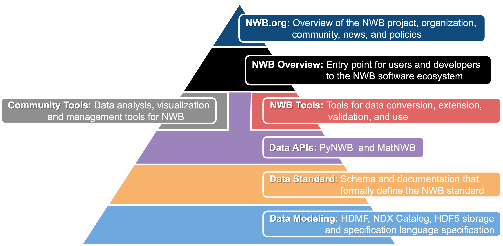

.. _main-home:

NWB Software Overview
======================

..
  :scale: 100 %
  :align: right

This website is an entry point for researchers and developers interested in using :nwb-main:`NWB`. If you are a new NWB
user and want to learn about the different tools available to convert your data to NWB, publish your NWB data, and
visualize and analyze NWB data, then you are in the right place! These pages will guide you through the main workflow
for each of those tasks and point you to the best tools to use for your preferred programming language and types of data.

.. toctree::
   :maxdepth: 1
   :caption: For Users

   intro_to_nwb/1_intro_to_nwb
   conversion_tutorial/user_guide
   extensions_tutorial/extensions_tutorial_home
   core_tools/core_tools_home
   file_read/file_read

.. toctree::
   :maxdepth: 1
   :titlesonly:

   tools/tools_home

.. toctree::
   :maxdepth: 1

   faq

.. toctree::
    :maxdepth: 1
    :caption: For Developers

    nwb_source_codes

Navigating the NWB Documentation
--------------------------------

NWB defines a large software ecosystem and as such there are many different documentation resources available depending
on what aspect of NWB and what type of information you want to learn more about. The following sketch provides an
overview of the main areas of the NWB documentation. As we navigate from the top of the pyramid to the
bottom, the level of detail and depth of the documentation increases. Most end-users will typically only interact with
the top half of the pyramid. If you are new to NWB and want to learn more; good news you are at the right place!

At the top (dark blue), we have the :nwb-main:`NWB.org` website, which focuses on the NWB project at large and provides
information about the overall organization, goals, community, and policies of the NWB project and functions as first
entry point to NWB.

Next we have the :ref:`NWB Overview <main-home>` (i.e., this website) (black), which serves as an entry point for
researchers and developers interested in using NWB and in learning more about the NWB software ecosystem.

The :pynwb-docs:`PyNWB (Python) <>` and :matnwb-docs:`MatNWB (Matlab) <>` reference APIs for NWB (lilac) provide full
support for reading and writing all components of the NWB standard. In addition, NWB provides a broad range of
:ref:`core tools <core-tools-home>` (red) to facilitate conversion, extension, validation and use of NWB data files.
Each of the APIs and tools provides their own in-depth tutorials and documentation to help guide users in adopting
and using the software.

The core NWB software then builds on a broad range of NWB data modeling tools and technologies (light blue),
e.g., :hdmf-docs:`HDMF <>` and the :ndx-catalog:`Neurodata Extension Catalog`.

Underlying all of this, is the :nwb-schema-docs:`NWB Format Specification <>`, which---in conjunction with the definition
of the :nwb-schema-language-docs:`specification language <>` and :nwb-storage-docs:`data storage <>`---formally defines
and governs the NWB data standard.

Last, but not least, there is a growing collection of :ref:`analysistools-home` (gray) developed by the broader
neurophysiology community that support NWB.

.. Indices and tables
.. ==================
..
.. * :ref:`genindex`
.. * :ref:`modindex`
.. * :ref:`search`
