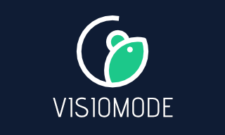

.. _acquisitiontools-home:

*****************************
Acquisition and Control Tools
*****************************

.. toctree::
    :maxdepth: 1
    :titlesonly:
    :hidden:

    mies/mies
    openephys/openephys
    visiomode/visiomode
    arcontrol/arcontrol

This page is a collection of tools we are cataloging as a convenience reference for NWB users. This is not a comprehensive list of NWB tools. Many of these tools are built and supported by other groups, and are in active development. If you would like to contribute a tool, please see the instructions :nwb-overview-src:`here <>`.

Acquiring Electrophysiology Data
---------------------------------

.. image:: mies/mies_screenshot.png
    :class: align-left
    :width: 180

.. include::  mies/mies.rst
        :start-after: .. short_description_start
        :end-before: .. short_description_end

.. raw:: html

     

.. image:: openephys/openephys_gui_screenshot.png
    :class: align-left
    :width: 180

.. include::  openephys/openephys.rst
        :start-after: .. short_description_start
        :end-before: .. short_description_end

.. raw:: html

    

     

Controlling and Recoding Behavioral Tasks
-----------------------------------------

.. include::  visiomode/visiomode.rst
        :start-after: .. short_description_start
        :end-before: .. short_description_end

.. raw:: html

     

.. image:: arcontrol/arcontrol_logo.png
    :class: align-left
    :width: 180

.. include::  arcontrol/arcontrol.rst
        :start-after: .. short_description_start
        :end-before: .. short_description_end

.. raw:: html

     

.. note::

        **Disclaimer:** Reference herein to any specific product, process, or service
        by its trade name, trademark, manufacturer, or otherwise, does not constitute or
        imply its endorsement, recommendation, or favoring by the NWB development team,
        United States Government or any agency thereof, or The Regents of the University
        of California. Use of the NeurodataWithoutBorders name for endorsements is prohibited.
