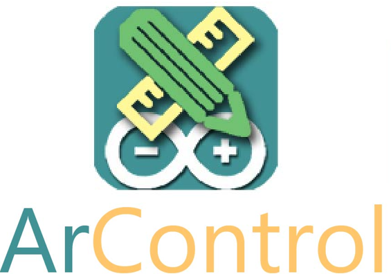

.. _acquisitiontools-arcontrol:

ArControl
------------

.. short_description_start

:ref:`acquisitiontools-arcontrol` is a Arduino based digital signals control system. A special application for ArControl is to establish a animal behavioral platform (as Skinner box), which control devices to deliver stimulation and monitor behavioral response. ArControl is also useful to generate Optogenetic TTL pulses. While ArControl does currently not support recording data directly in NWB, it provides tools for converting ArControl data to NWB. :bdg-link-primary:`NWB conversion tool <https://github.com/chenxinfeng4/ArControl-convert2-nwb>` :bdg-link-primary:`Demo <https://github.com/chenxinfeng4/ArControl-convert2-nwb/blob/main/playground/demo_convert.ipynb>` :bdg-link-primary:`ArControl Source <https://github.com/chenxinfeng4/ArControl>`

.. short_description_end

