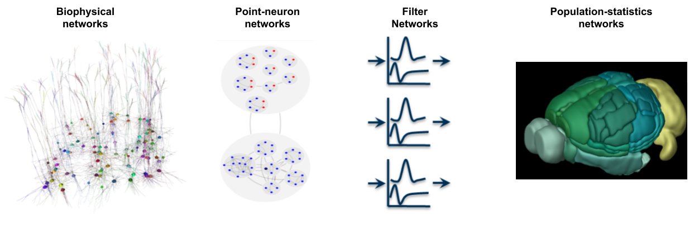

.. _analysistools-bmtk:

Brain Modeling Toolkit (BMTK)
-----------------------------

.. short_description_start

:ref:`analysistools-bmtk`, SONATA, and Visual Neuronal Dynamics (VND) are mutually integrated software tools that are particularly suited to support large-scale bio-realistic brain modeling, but are applicable to a variety of neuronal modeling applications. BMTK is a suite for building and simulating network models at multiple levels of resolution, from biophysically-detailed, to point-neuron, to population-statistics approaches. The modular design of BMTK allows users to easily work across different scales of resolution and different simulation engines using the same code interface. The model architecture and parameters, as well as simulation configuration, input, and output are stored together in the SONATA data format. Models and their output activity can then be visualized with the powerful rendering capabilities of VND. :bdg-link-primary:`Docs <https://alleninstitute.github.io/bmtk>` :bdg-link-primary:`Tutorial <https://alleninstitute.github.io/bmtk/tutorials.html>` :bdg-link-primary:`NWB Spike Stimulus <https://alleninstitute.github.io/bmtk/ecephys_probe.html>`  :bdg-link-primary:`Source <https://github.com/AllenInstitute/bmtk>`

.. image:: https://img.shields.io/github/stars/AllenInstitute/bmtk?style=social
    :alt: GitHub Repo stars for BTMK
    :target: https://github.com/AllenInstitute/bmtk

.. short_description_end

**Cite** Dai et al. Brain Modeling Toolkit: An open-source software suite for multiscale modeling of brain circuits. PLoS Comput Biol 16(11): e1008386. https://doi.org/10.1371/journal.pcbi.1008386