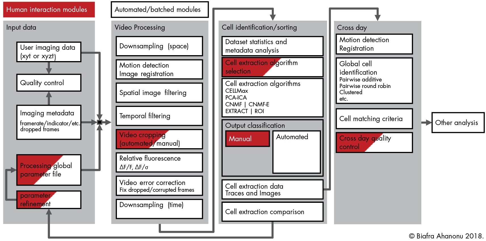

.. _analysistools-ciatah:

CIAtah
------

.. short_description_start

:ref:`analysistools-ciatah` (pronounced cheetah; formerly calciumImagingAnalysis) is a Matlab software package for analyzing one- and two-photon calcium imaging datasets. :bdg-link-primary:`Video tutorial <https://www.youtube.com/watch?v=I6abW3uuJJw>` :bdg-link-primary:`Docs <https://bahanonu.github.io/ciatah/>` :bdg-link-primary:`Source <https://github.com/bahanonu/calciumImagingAnalysis>`.

.. image:: https://img.shields.io/github/stars/bahanonu/calciumImagingAnalysis?style=social
    :alt: GitHub Repo stars for CIAtah
    :target: https://github.com/bahanonu/calciumImagingAnalysis

.. short_description_end

