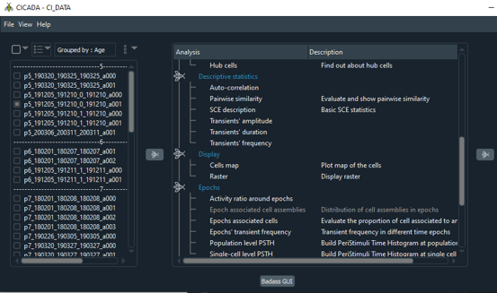

.. _analysistools-cicada:

CICADA
------

.. short_description_start

:ref:`analysistools-cicada` is a Python pipeline providing a graphical user interface (GUI) that allows the user to visualize, explore and analyze Calcium Imaging data contained in NWB files. :bdg-link-primary:`Docs <https://pycicada.readthedocs.io/en/latest/tutorial.html>` :bdg-link-primary:`Source <https://gitlab.com/cossartlab/cicada/>` :bdg-link-primary:`Video Demo <https://www.youtube.com/watch?v=xgf2RmrGVx0>` :bdg-link-primary:`Cite <https://elifesciences.org/articles/78116#s4-5-6>`

.. short_description_end

