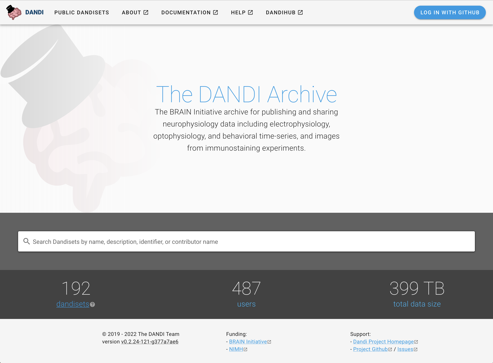

.. _analysistools-dandi:

DANDI
------

.. short_description_start

:ref:`analysistools-dandi` (Distributed Archives for Neurophysiology Data Integration) is the
NIH BRAIN Initiative archive for publishing and sharing neurophysiology data including
electrophysiology, optophysiology, and behavioral time-series, and images from
immunostaining experiments.
:bdg-link-primary:`Online Archive <https://dandiarchive.org/>`
:bdg-link-primary:`Docs <https://www.dandiarchive.org/handbook>`
:bdg-link-primary:`Source <https://github.com/dandi>`.

.. short_description_end

DANDI is:

* An open data archive to submit neurophysiology data for electrophysiology,
  optophysiology, and behavioral time-series, and images from immunostaining experiments.
*  A persistent, versioned, and growing collection of standardized datasets.
*  A place to house data to collaborate across research sites.
*  Supported by the BRAIN Initiative and the AWS Public dataset programs.

DANDI provides significant benefits:

* A FAIR (Findable, Accessible, Interoperable, Reusable) data archive to house
  standardized neurophysiology and associated data.
* Rich metadata to support search across data.
* Consistent and transparent data standards to simplify data reuse and software
  development. We use the Neurodata Without Borders, Brain Imaging Data Structure,
  Neuroimaging Data Model (NIDM), and other BRAIN Initiative standards to
  organize and search the data.
* The data can be accessed programmatically allowing for software to work directly
  with data in the cloud.
* The infrastructure is built on a software stack of open source products, thus
  enriching the ecosystem.

