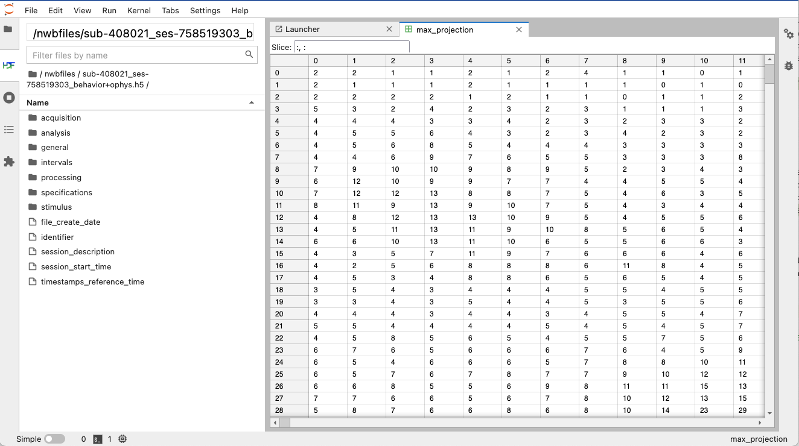
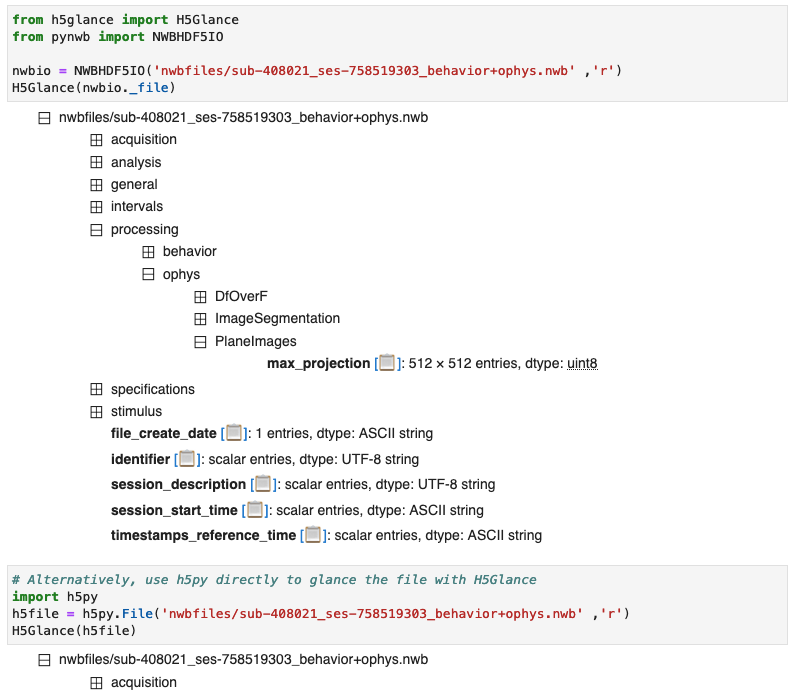

.. _analysistools-hdftools:

HDF Tools
---------

.. short_description_start

There are a broad range of useful tools for inspecting and browsing HDF5 files. For example,
HDFView and HDF5 plugins for Jupyter or VSCode provide general visual
tools for browsing HDF5 files. In addition, the HDF5 library
ships with a range of command line tools
that can be useful for developers (e.g., *h5ls* and *h5dump* to introspect,
*h5diff* to compare, or *h5copy* and *h5repack* to copy HDF5 files).
While these tools do not provide NWB-specific functionality, they are useful
(mainly for developers) to debug and browse NWB HDF5 files.
:bdg-link-primary:`HDFView <https://www.hdfgroup.org/downloads/hdfview/>`
:bdg-link-primary:`HDF5 CLI tools <https://portal.hdfgroup.org/display/HDF5/HDF5+Command-line+Tools>`
:bdg-link-primary:`vscode-h5web <https://marketplace.visualstudio.com/items?itemName=h5web.vscode-h5web>`
:bdg-link-primary:`h5glance <https://github.com/European-XFEL/h5glance>`
:bdg-link-primary:`jupyterlab-h5web <https://github.com/silx-kit/jupyterlab-h5web>`
:bdg-link-primary:`jupyterlab-hdf5 <https://github.com/jupyterlab/jupyterlab-hdf5>`

.. short_description_end

.. note::

    **Compatability with NWB:** The tools listed here are generic HDF5 tools and as such are
    not aware of the NWB schema. Modifying NWB files using generic HDF5 tools
    can result in invalid NWB files. Use of these tools is, hence, primarily
    useful for developers, e.g., for debugging and visual inspection of NWB files.

Examples
^^^^^^^^

* :ref:`analysistools-hdftools-hdfview`
* :ref:`analysistools-hdftools-cli`
* :ref:`analysistools-hdftools-jupyter`
* :ref:`analysistools-hdftools-vscode`

.. _analysistools-hdftools-hdfview:

HDFView
"""""""

.. image:: https://www.hdfgroup.org/wp-content/uploads/2017/07/hdfview-sample2.jpg
    :class: align-right
    :width: 350

`HDFView <https://www.hdfgroup.org/downloads/hdfview/>`_  is a visual tool written in Java for browsing
and editing HDF (HDF5 and HDF4) files. Using HDFView, you can: i) view a file hierarchy in a tree structure
ii) create new files, add or delete groups and datasets, iii) view and modify the content of a dataset,
iv) add, delete and modify attributes. HDFView uses the Java HDF Object Package, which implements HDF4
and HDF5 data objects in an object-oriented form.
:bdg-link-primary:`Download <https://www.hdfgroup.org/downloads/hdfview/>`
:bdg-link-primary:`Source <https://github.com/HDFGroup/hdfview>`

.. _analysistools-hdftools-cli:

HDF5 Command-line Tools
"""""""""""""""""""""""

The HDF5 software distribution ships with a broad range of
`HDF5 command-line utilities <https://portal.hdfgroup.org/display/HDF5/HDF5+Command-line+Tools>`_ that
cover a broad range of tasks useful for debugging and inspecting HDF5 files, for example:

* **CLI tools for inspecting HDF5 files:**

    * `h5ls <https://portal.hdfgroup.org/display/HDF5/h5ls>`_  lists selected information about file objects in the specified format

        .. tip::

            *h5ls* can also be used with remote files on S3 via ``h5ls --vfd=ros3 -r <s3path>`` or on Windows
            via ``h5ls --vfd=ros3 --s3-cred="(,,)" <s3path>``

    * `h5dump <https://portal.hdfgroup.org/display/HDF5/h5dump>`_ enables the user to examine the contents of an HDF5 file and dump those contents to an ASCII file.
    * `h5diff <https://portal.hdfgroup.org/display/HDF5/h5diff>`_ compares two HDF5 files and reports the differences. *h5diff* is for serial use while *ph5diff* is for use in parallel environments.
    * `h5check <https://portal.hdfgroup.org/display/HDF5/h5check>`_ verifies that an HDF5 file is encoded according to the HDF5 specification.
    * `h5stat <https://portal.hdfgroup.org/display/HDF5/h5stat>`_ displays object and metadata information for an HDF5 file.
    * `h5watch <https://portal.hdfgroup.org/display/HDF5/h5watch>`_ Outputs new records appended to a dataset as the dataset grows similar to the Unix user command ``tail``.
    * *h5debug* debugs an existing HDF5 file at a low level.

* **CLI tools to copy, clean, and edit HDF5 files:**

    * `h5repack <https://portal.hdfgroup.org/display/HDF5/h5repack>`_  copies an HDF5 file to a new file with or without compression/chunking and is typically used to apply HDF5 filters to an input file and saving the output in a new output file.
    * `h5copy <https://portal.hdfgroup.org/display/HDF5/h5copy>`_ copies an HDF5 object (a dataset, named datatype, or group) from an input HDF5 file to an output HDF5 file.
    * `h5repart <https://portal.hdfgroup.org/display/HDF5/h5repart>`_ repartitions a file or family of files, e.g,. to  join a family of files into a single file or to copy one family of files to another while changing the size of the family members.
    *  `h5clear <https://portal.hdfgroup.org/display/HDF5/h5clear>`_  clears superblock status_flags field, removes metadata cache image, prints EOA and EOF, or sets EOA of a file.

These are just a few select tools most relevant to debugging NWB files. See the `HDF5 command-line utilities page <https://portal.hdfgroup.org/display/HDF5/HDF5+Command-line+Tools>`_ for a more detailed overview.

.. _analysistools-hdftools-jupyter:

Jupyter HDF5 plugins
""""""""""""""""""""

`JupyterLab <https://jupyter.org/>`_ is a popular web-based interactive development environment for notebooks, code, and data. Its flexible interface allows users to configure and arrange workflows in data science, scientific computing, computational journalism, and machine learning. There are several extensions available to facilitate browsing and visualization of HDF5 in JupyterLab and Python notebooks. :bdg-link-primary:`h5glance <https://github.com/European-XFEL/h5glance>`
:bdg-link-primary:`jupyterlab-h5web <https://github.com/silx-kit/jupyterlab-h5web>` :bdg-link-primary:`jupyterlab-hdf5 <https://github.com/jupyterlab/jupyterlab-hdf5>`

The different libraries each offer slightly different approaches towards visualizaing HDF5 files in Jupyter. `h5glance <https://github.com/European-XFEL/h5glance>`_ displays an interactive hierarchy of the HDF5 inline in a Python code notebook. `jupyterlab-hdf5 <https://github.com/jupyterlab/jupyterlab-hdf5>`_ shows the tree in the left sidebar of the JupyterLab UI with additional visualizations shown as separate tabs in the main window. `jupyterlab-h5web <https://github.com/silx-kit/jupyterlab-h5web>`_ shows both the tree and additional visualization in a single additional tab in the main Jupyter window.

.. tip::

   Some extensions expect the file extensions ``.h5`` to identify HDF5 files. To allow opening of NWB HDF5 files
   with these tools may require creating custom file associations or renaming NWB files to use the ``.h5`` extension.

.. figure:: jupyterlab_h5web_nwb_example.png
    :width: 600

    *jupyterlab-h5web* visualization of an example NWB file/

    *jupyterlab-hdf5* visualization of an example NWB file.

    *h5glance* visualization of an example NWB file.

.. _analysistools-hdftools-vscode:

VSCode HDF5 plugin
""""""""""""""""""

Much like the `jupyterlab-h5web <https://github.com/silx-kit/jupyterlab-h5web>`_ plugin, the  `H5Web Vscode plugin <https://marketplace.visualstudio.com/items?itemName=h5web.vscode-h5web>`_ provides an H5Web Viewer to browse HDF5 files in VSCode. :bdg-link-primary:`vscode-h5web <https://marketplace.visualstudio.com/items?itemName=h5web.vscode-h5web>`

.. note::

    NWB typically uses the ``*.nwb`` file extension, which is not associated by default with the H5Web plugin. To open an NWB file you can either use ``right click -> Open with... -> H5Web (any extension)`` or you can use VS Code's ``workbench.editorAssociations`` setting to set H5Web as the default editor for additional extensions:

    .. code-block::

        "workbench.editorAssociations": {
          "*.nwb": "h5web.viewer",
        },

