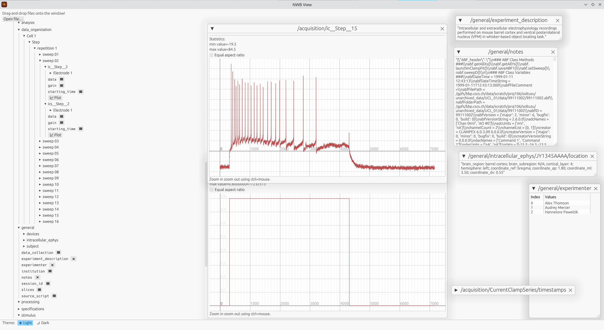

.. _analysistools-nwbview:

Nwbview
------------

.. image:: nwbview-icon.png
    :class: align-left
    :width: 100

.. short_description_start

:ref:`analysistools-nwbview` is a cross-platform software with a graphical user interface to display the contents of the binary NWB file format. It is written in Rust for high-performance, memory safety and ease of deployment.
Its features include the ability to display the contents of the NWB file in a tree structure. It displays voltage and current recordings data in interactive plots. The tabular data or the text data present in the NWB can be displayed in a scalable window.
:bdg-link-primary:`Docs <https://crates.io/crates/nwbview>` :bdg-link-primary:`Source <https://github.com/brainhack-ch/nwbview>`.

.. short_description_end

.. raw:: html

     
     
     

The screenshot below shows the `nwbview` GUI. The left panel shows the contents of the NWB file in a tree structure. The right panel shows the details of the selected item, which can be a plot, a table or a text.

`nwbview` uses the `egui <https://github.com/emilk/egui>`_ Rust GUI library for rendering.

To install and run using cargo
~~~~~~~~~~~~~~~~~~~~~~~~~~~~~~~

Cargo is the package manager for Rust, and `nwbview` is listed as a package there. You can find it on `crates.io <https://crates.io/crates/nwbview>`_.

**Note:** HDF5 needs to be installed in your system as cargo will try to locate the HDF5 root directory and/or headers.

First install the `cargo` package manager and then run the following command to install `nwbview`.

.. code-block:: shell

    cargo install nwbview

Once you completed the installation, simply type `nwbview` on the console to run it.

.. code-block:: shell

    nwbview

To build and run from the source code
~~~~~~~~~~~~~~~~~~~~~~~~~~~~~~~~~~~~~

The Rust library dependencies are provided in the `cargo.toml` file.

Note that the Rust libraries depend on the following system packages that need to be provided.

* `libgtk-3-dev`
* `librust-atk-dev`
* `libhdf5-serial-dev`

The exact names of the packages may differ between systems.

Once all the dependencies are satisfied, go to the directory containing `cargo.toml` and run the following command.

.. code-block:: shell

    cargo run --release

The release flag builds the artifacts with optimizations. Do not specify it when you need to debug.
