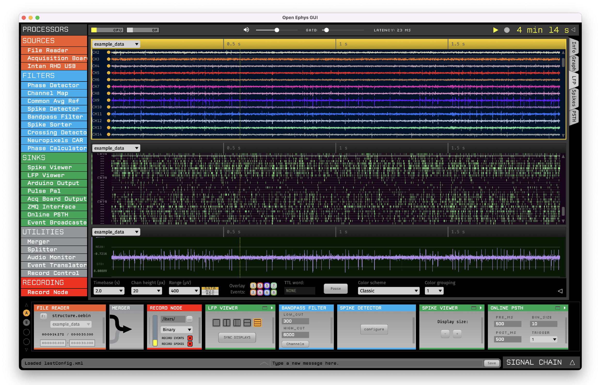

.. _acquisitiontools-openephys:

OpenEphys GUI
-------------

.. short_description_start

:ref:`acquisitiontools-openephys` is a modular, open-source software for extracellular electrophysiology. Built by neuroscientists, for neuroscientists, OpenEphys GUI has all the features needed to acquire and visualize electrophysiology data, while making it easy to add new modules written in C++. The GUI allows the user to configure processing pipelines by mixing and matching modules. Using the NWB format plugin, users can record data directly in NWB format via the OpenEphys GUI. --- **OpenEphys GUI:** :bdg-link-primary:`Docs <https://open-ephys.github.io/gui-docs/User-Manual/>` :bdg-link-primary:`Website <https://open-ephys.org/gui>` :bdg-link-primary:`Source <https://github.com/open-ephys/plugin-GUI>`  ---  **NWB Plugin for OpenEphys**: :bdg-link-primary:`Docs <https://open-ephys.github.io/gui-docs/User-Manual/Recording-data/NWB-format.html>`  :bdg-link-primary:`Source <https://github.com/open-ephys-plugins/nwb-format>`

.. image:: https://img.shields.io/github/stars/open-ephys-plugins/nwb-format?style=social
    :alt: GitHub Repo stars for the NWB format plugin
    :target: https://github.com/open-ephys-plugins/nwb-format

.. short_description_end

