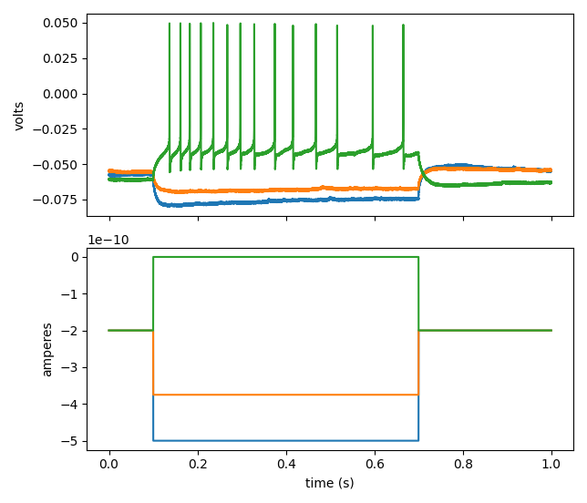

.. _analysistools-patchview:

PatchView
----------

.. short_description_start

:ref:`analysistools-patchview` is a GUI tool to perform data analysis and visualization on multi channel whole-cell recording (multi-patch) data, including firing pattern analysis, mini-event analysis, synaptic connection detection, morphological analysis and more.
:bdg-link-primary:`Documentation <https://patchview.readthedocs.io/en/latest/?badge=latest>`
:bdg-link-primary:`Source <https://github.com/ZeitgeberH/patchview>`
:bdg-link-primary:`Publication <https://joss.theoj.org/papers/10.21105/joss.04706>`

.. short_description_end

.. image:: patchview.png
    :class: align-center
    :width: 600

-----

NWB (NeurodataWithoutBorders) APIs
^^^^^^^^^^^^^^^^^^^^^^^^^^^^^^^^^^^^
PatchView reads Heka or Axon format files for patch-clamp data, and uses `PyNWB <https://github.com/NeurodataWithoutBorders/pynwb>`_ to export to NWB files.

Code snippet shows how to convert data from original Heka .dat file into an extended `NWBFile` object, query the content and generate a visualization.

.. code-block:: python

    from patchview.utilitis.PVdat2NWB import dat2NWB

    nwbData = dat2NWB('test_singleFP.dat', [0,0]) # extract group 0, series 0 from the file
    print(nwbData.fields.keys())

    ## get number of sweeps
    print(f'Number of sweeps: {nwbData.getNumberOfSweeps()}')

    ## nwbData is an extended pynwb NWB object 
    stim, resp = nwbData.getSweep(0) # get one sweep's stimulus and responses

    ## with additional plotting functions.
    nwbData.plotSweep([0, 5, 20]) #  plot sweep number 0, 5, 20

The last command in the block above should give you a figure like this:

