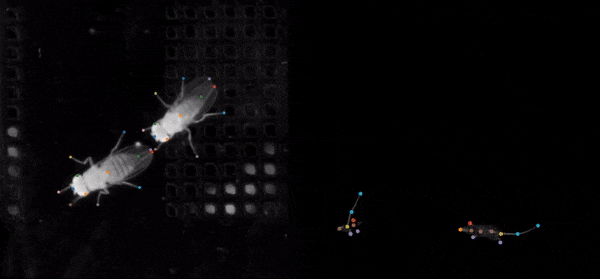

.. _analysistools-sleap:

SLEAP
-----

.. short_description_start

:ref:`analysistools-sleap` is an open source deep-learning based 
framework for multi-animal pose tracking. It can be used to track any type or 
number of animals and includes an advanced labeling/training GUI for active 
learning and proofreading.
:bdg-link-primary:`Documentation <https://sleap.ai>`

.. image:: https://img.shields.io/github/stars/talmolab/sleap?style=social
    :alt: GitHub Repo stars for SLEAP
    :target: https://github.com/talmolab/sleap

.. short_description_end

SLEAP has developed 
`NDXPoseAdaptor <https://sleap.ai/api/sleap.io.format.ndx_pose.html#module-sleap.io.format.ndx_pose>`_
, an adaptor class within SLEAP for importing and exporting NWB files. Users can either 
use the SLEAP GUI to import/export NWB files or use the high-level API 
`Labels.export_nwb <https://sleap.ai/api/sleap.io.dataset.html#sleap.io.dataset.Labels.export_nwb>`_ 
to programatically export to the NWB format. This adaptor uses the NWB extension 
`ndx-pose <https://github.com/rly/ndx-pose>`_, which aims to provide a standardized 
format for storing pose estimation data in NWB.