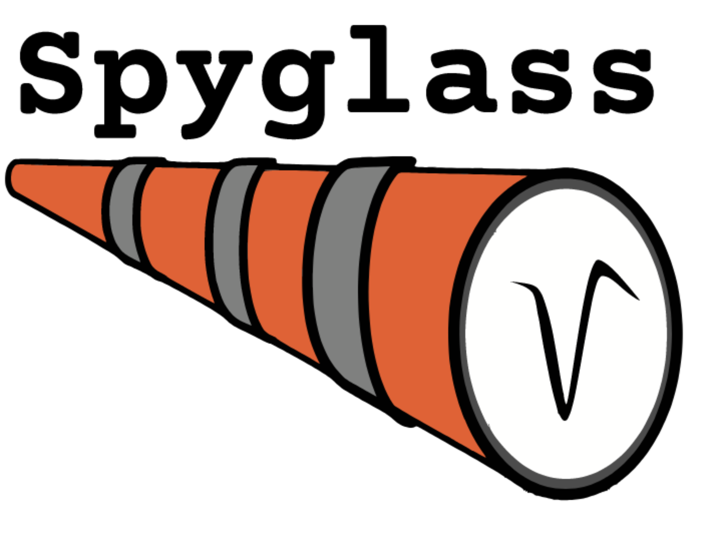

.. _analysistools-spyglass:

Spyglass
--------

.. short_description_start

:ref:`analysistools-spyglass` is a framework for building your analysis workflows with a focus on reproducibility and sharing. Spyglass uses community-developed open-source projects such as NWB and DataJoint to manage data in a shareable format, build and run pipelines and store their inputs and outputs in a relational database, and generate visualizations of analysis results for sharing with the community. It comes with ready-to-use pipelines for spike sorting, LFP analysis, position processing, and fitting of state space models for decoding variables of interest from neural data.
:bdg-link-primary:`Docs <https://lorenfranklab.github.io/spyglass/>`
:bdg-link-primary:`Source <https://github.com/LorenFrankLab/spyglass>`.

.. image:: https://img.shields.io/github/stars/LorenFrankLab/spyglass?style=social
    :alt: GitHub Repo stars for Spyglass
    :target: https://github.com/LorenFrankLab/spyglass

.. short_description_end

