.. _analysistools-home:

********************************
Analysis and Visualization Tools
********************************

.. toctree::
    :maxdepth: 1
    :titlesonly:
    :hidden:

    nwbwidgets/nwbwidgets
    nwbexplorer/nwbexplorer
    hdfview/hdfview
    spikeinterface/spikeinterface
    cellexplorer/cellexplorer
    ecogvis/ecogvis
    neo/neo
    caiman/caiman
    suite2p/suite2p
    ciatah/ciatah
    extract/extract
    mies/mies
    patchview/patchview
    deeplabcut/deeplabcut
    sleap/sleap
    pynapple/pynapple
    dandi/dandi

This is a page is a collection of tools we are cataloging as a convenience reference for NWB users. This is not a comprehensive list of NWB tools. Many of these tools are built and supported by other groups, and are in active development. If you would like to contribute a tool, please see the instructions :nwb-overview-src:`here <>`.

.. _analysistools-explore:

Exploring NWB Files
-------------------

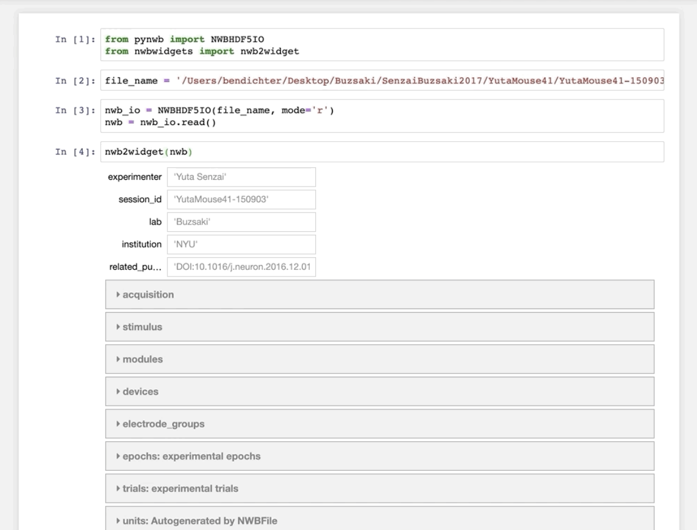

.. include::  nwbwidgets/nwbwidgets.rst
        :start-after: .. short_description_start
        :end-before: .. short_description_end

.. raw:: html

     
     
     

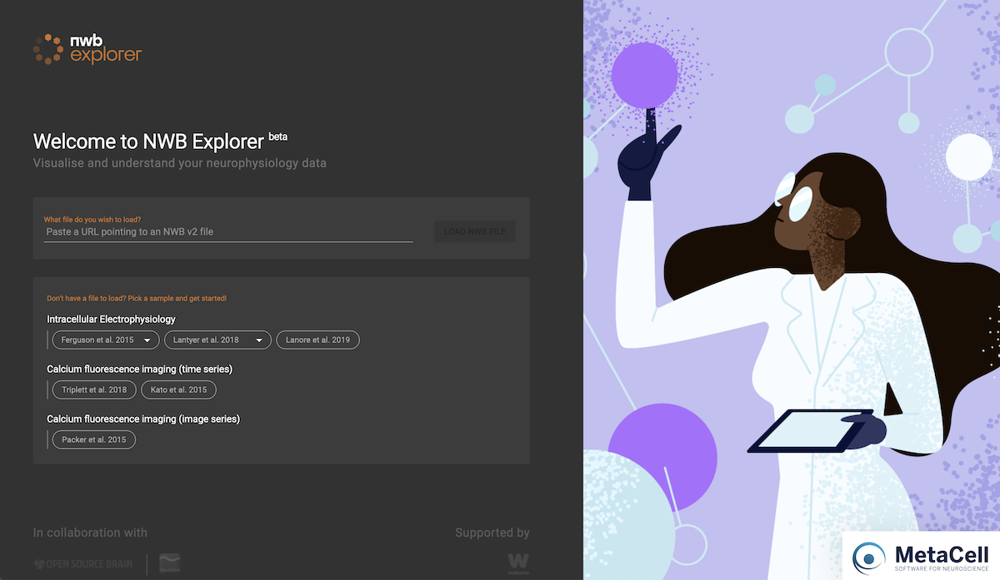

.. include::  nwbexplorer/nwbexplorer.rst
        :start-after: .. short_description_start
        :end-before: .. short_description_end

.. raw:: html

     
     

.. image:: https://www.hdfgroup.org/wp-content/uploads/2017/07/hdfview-sample2.jpg
    :class: align-left
    :width: 180

.. include::  hdfview/hdfview.rst
        :start-after: .. short_description_start
        :end-before: .. short_description_end

.. raw:: html

     
    

     

.. _analysistools-ecephys:

Extracellular Electrophysiology Tools
------------------------------------------------

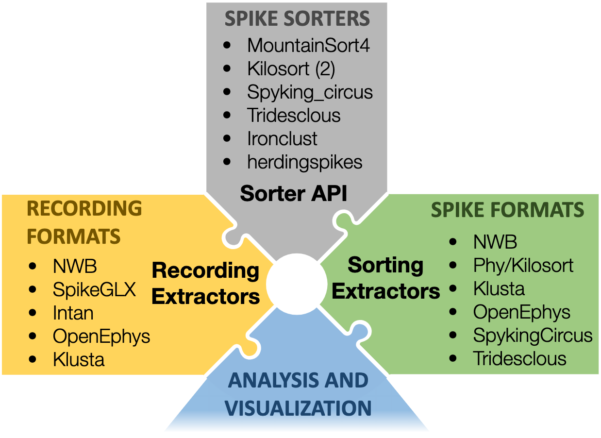

.. include::  spikeinterface/spikeinterface.rst
        :start-after: .. short_description_start
        :end-before: .. short_description_end

.. raw:: html

     
     
     
     

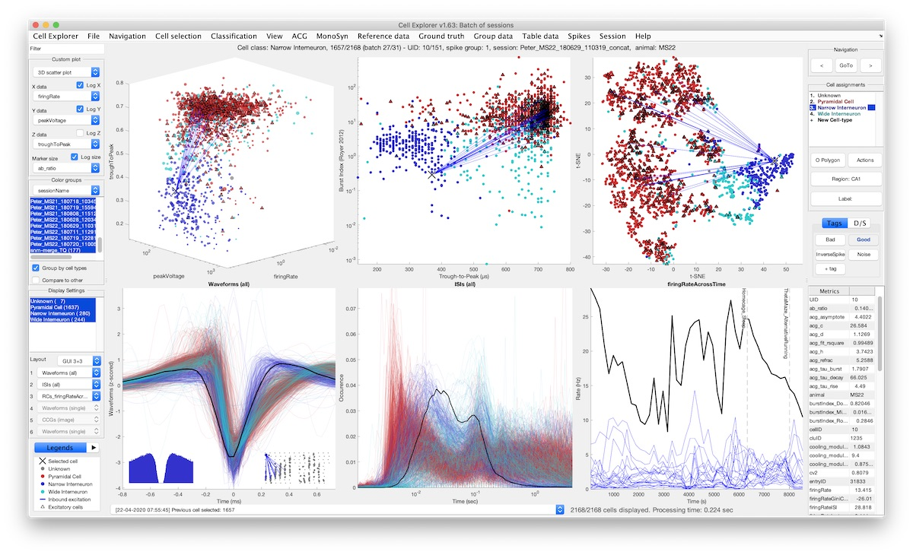

.. include::  cellexplorer/cellexplorer.rst
        :start-after: .. short_description_start
        :end-before: .. short_description_end

.. raw:: html

     
     
     

.. image:: ecogvis/ecogvis_screenshot.png
    :class: align-left
    :width: 180

.. include::  ecogvis/ecogvis.rst
        :start-after: .. short_description_start
        :end-before: .. short_description_end

.. raw:: html

     
     

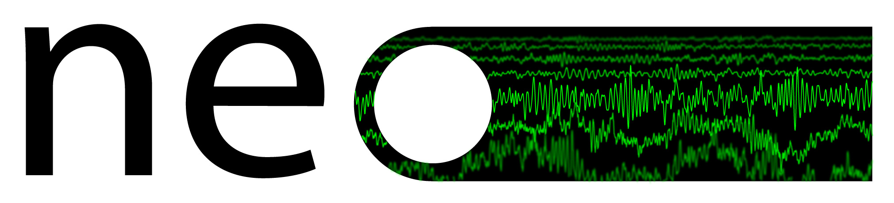

.. include::  neo/neo.rst
        :start-after: .. short_description_start
        :end-before: .. short_description_end

.. raw:: html

     
    

     

.. _analysistools-ophys:

Optical Physiology Tools
------------------------

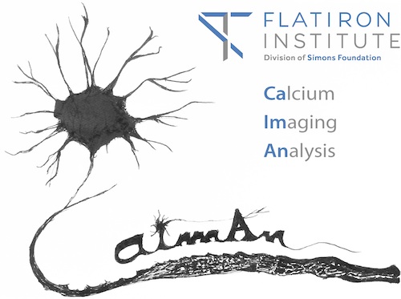

.. include::  caiman/caiman.rst
        :start-after: .. short_description_start
        :end-before: .. short_description_end

.. raw:: html

     
     
     

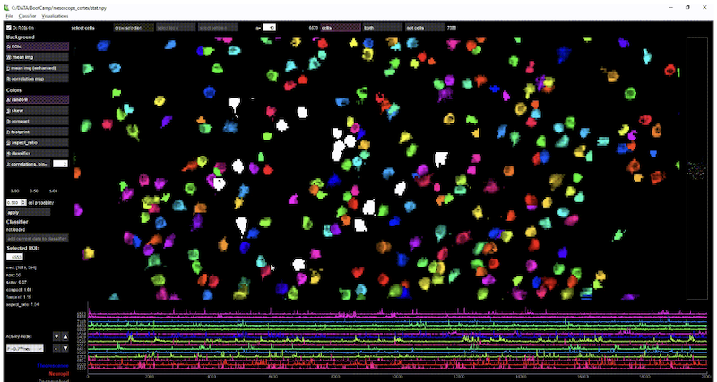

.. include::  suite2p/suite2p.rst
        :start-after: .. short_description_start
        :end-before: .. short_description_end

.. raw:: html

     
     
     

.. include::  ciatah/ciatah.rst
        :start-after: .. short_description_start
        :end-before: .. short_description_end

.. raw:: html

     
     
     

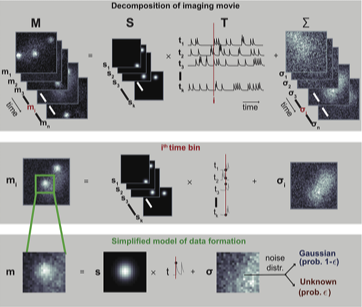

.. include::  extract/extract.rst
        :start-after: .. short_description_start
        :end-before: .. short_description_end

.. raw:: html

     
    

     

.. _analysistools-icephys:

Intracellular Electrical Physiology Tools
-----------------------------------------

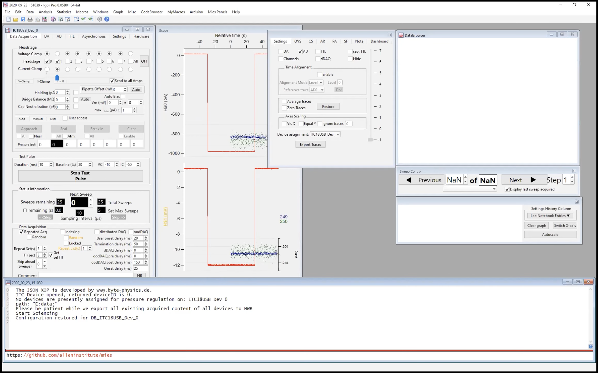

.. include::  mies/mies.rst
        :start-after: .. short_description_start
        :end-before: .. short_description_end

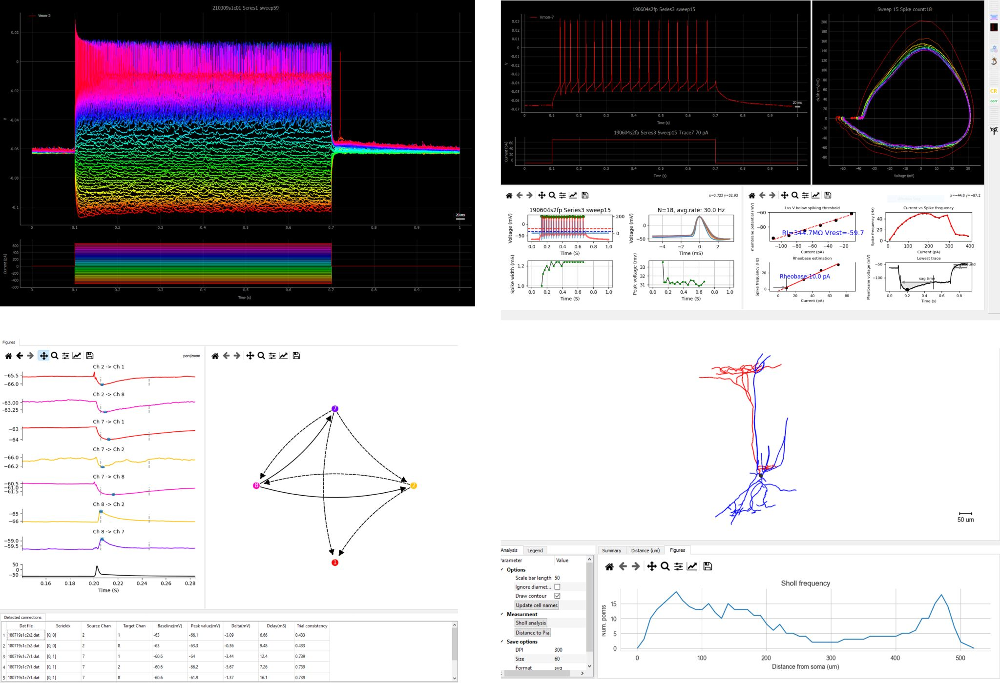

.. include::  patchview/patchview.rst
        :start-after: .. short_description_start
        :end-before: .. short_description_end

.. raw:: html

     
    

     

.. _analysistools-behavior:

Behavior
--------

.. image:: deeplabcut/deeplabcut.gif
    :class: align-left
    :width: 180

.. include::  deeplabcut/deeplabcut.rst
        :start-after: .. short_description_start
        :end-before: .. short_description_end

.. raw:: html

     
     
     

.. image:: sleap/sleap.gif
    :class: align-left
    :width: 180

.. include::  sleap/sleap.rst
        :start-after: .. short_description_start
        :end-before: .. short_description_end

.. raw:: html

     
    

     

.. _analysistools-general:

Data Analysis Toolbox
----------------------

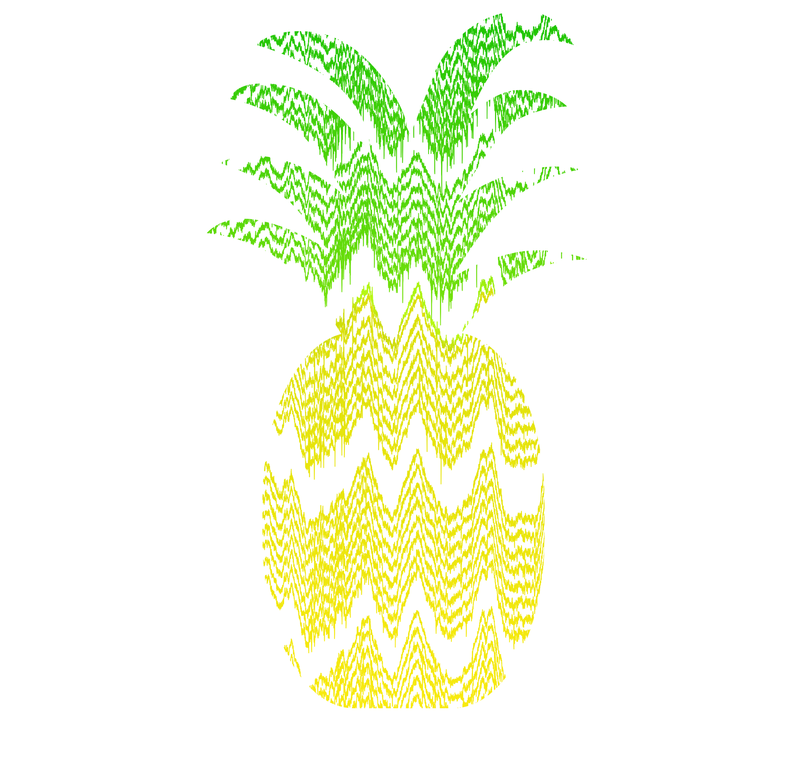

.. include::  pynapple/pynapple.rst
        :start-after: .. short_description_start
        :end-before: .. short_description_end

.. raw:: html

     
    

     

.. _analysistools-archive:

Data Archive, Publication, and Management
-----------------------------------------

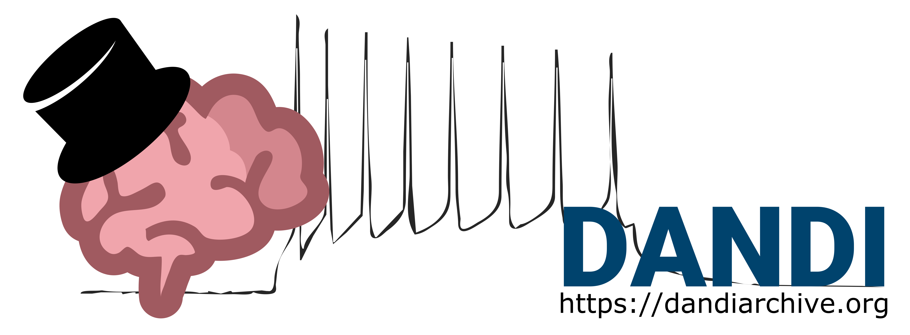

.. include::  dandi/dandi.rst
        :start-after: .. short_description_start
        :end-before: .. short_description_end

.. note::

        **Disclaimer:** Reference herein to any specific product, process, or service
        by its trade name, trademark, manufacturer, or otherwise, does not constitute or
        imply its endorsement, recommendation, or favoring by the NWB development team,
        United States Government or any agency thereof, or The Regents of the University
        of California. Use of the NeurodataWithoutBorders name for endorsements is prohibited.
