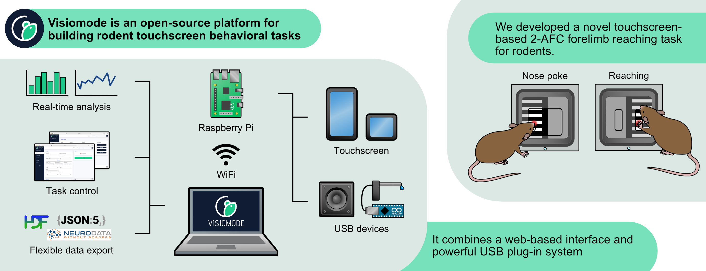

.. _analysistools-visiomode:

Visiomode
------------

.. short_description_start

:ref:`analysistools-visiomode` is an open-source platform for building touchscreen-based behavioral tasks for rodents. It leverages the inherent flexibility of touchscreens to offer a simple yet adaptable software and hardware platform. Visiomode is built on the Raspberry Pi computer combining a web-based interface and powerful plug-in system with an operant chamber that can be adapted to generate a wide range of behavioral tasks. :bdg-link-primary:`Docs <https://www.visiomode.org>` :bdg-link-primary:`Source <https://github.com/DuguidLab/visiomode>` :bdg-link-primary:`Publication <https://doi.org/10.1016/j.jneumeth.2022.109779>`

.. short_description_end

Compatibility with NWB 
^^^^^^^^^^^^^^^^^^^^^^^

Visiomode session data can be exported to the NWB format directly from the web interface. Navigate to the "History" tab, choose the session you wish to export and select "NWB" from the "Download" dropdown menu. The NWB file will be downloaded to your computer.

.. only:: html

    .. image:: visiomode-nwb-export.gif
        :class: align-left
        :width: 100%

.. only:: latex

    .. image:: visiomode-nwb-export-still.png
        :class: align-left
        :width: 100%

Visiomode stores behavioural data under ``trials`` (`docs <https://pynwb.readthedocs.io/en/stable/tutorials/general/plot_timeintervals.html#trials>`_). The ``trials`` table contains the following columns:

    - ``start_time``: the time at which the trial started
    - ``stop_time``: the time at which the trial ended
    - ``stimulus``: identifier of the stimulus presented during the trial
    - ``cue_onset``: the time at which the cue was presented
    - ``response``: type of response (e.g. touch on left or right side of the screen)
    - ``response_time``: the time of the response (i.e. the time at which the animal touched the screen)
    - ``pos_x``: the x-coordinate of the touch
    - ``pos_y``: the y-coordinate of the touch
    - ``dist_x``: the touch drag distance in the x-direction
    - ``dist_y``: the touch drag distance in the y-direction
    - ``outcome``: the outcome of the trial (e.g. correct or incorrect)
    - ``correction``: whether the trial was a correction trial (if using)
    - ``sdt_type``: signal detection theory classification of trial in visual discrimination tasks (if using)

The exported NWB file can then be combined with neurophysiological recordings by linking recording data from different files `as described in the NWB documentation <https://pynwb.readthedocs.io/en/stable/tutorials/advanced_io/linking_data.html#sphx-glr-tutorials-advanced-io-linking-data-py>`_. Please take care to synchronize the timestamps of the behavioural and neurophysiological data before linking them, by recalculating the timestamps relative to the reference time of the behaviour file. For example:

.. code-block:: python

    from pynwb import NWBHDF5IO, TimeSeries 

    # Load the Visiomode NWB file
    io_behavior = NWBHDF5IO("/path/to/visiomode-behavior.nwb", "r")
    nwbfile_behavior = io_behavior.read()

    # Load an NWB file with neurophysiological data
    io_neurophys = NWBHDF5IO("/path/to/neurophys.nwb", "r")
    nwbfile_neurophys = io_neurophys.read()

    # Recalculate the timestamps of the neurophysiological data relative 
    # to the reference start time in the behavior file
    timestamp_offset = (
            nwbfile_neurophys.session_start_time - nwbfile_behavior.session_start_time
        ).total_seconds()

    recalc_timestamps = [
            timestamp - timestamp_offset
            for timestamp in nwbfile_neurophys.acquisition["DataTimeSeries"].timestamps
        ]
    
    # Link the neurophysiological data to the behaviour file
    neurophys_timeseries = TimeSeries(
        name="DataTimeSeries",
        data=nwbfile_neurophys.acquisition["DataTimeSeries"].data, # Link to original data
        timestamps=recalc_timestamps,  # Remember to add the recalculated timestamps! 
        description="Neurophysiological data",
        ...
    )

    nwbfile_behavior.add_acquisition(neurophys_timeseries)

    # Export data to a new "linker" NWB file
    io_linker = NWBHDF5IO("/path/to/linker-behavior+phys.nwb", "w")
    io_linker.write(nwbfile_behavior, link_data=True)

    # Clean up
    io_behavior.close()
    io_neurophys.close()
    io_linker.close()

